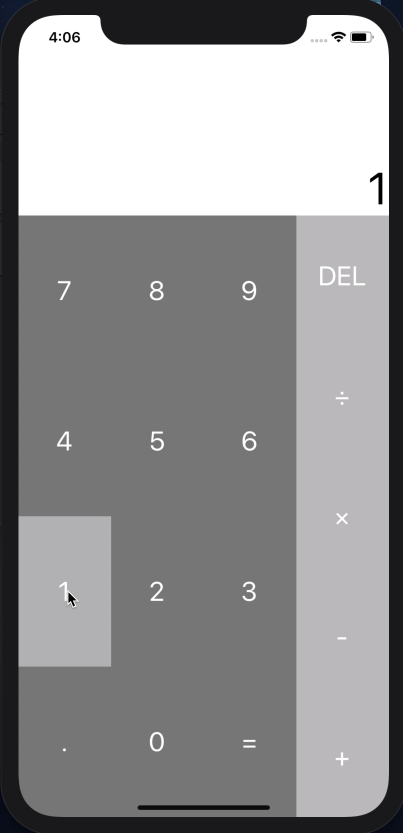

# React Native Calc

## Screenshot


## Dependecies
- node (ver 10.16.3, recommend using [nodenv](https://github.com/nodenv/nodenv))
- expo-cli

## How to ran
### 1. Prepare (at once)
```bash
nodenv install 10.16.3 # if use nodenv and not installed ver 10.16.3
npm install -g expo-cli # install expo-cli
npm install
```

### 2. Run
```bash
npm start
# and follow screen...
```
Detail: refer to the "Running your React Native application" on React Native [Getting Started](https://facebook.github.io/react-native/docs/getting-started)
